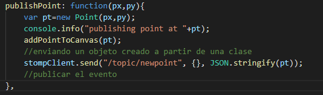
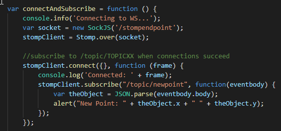
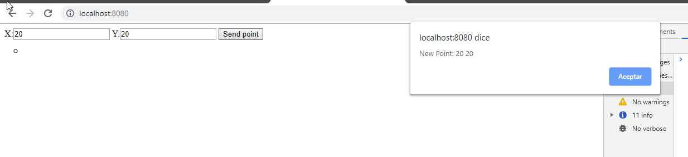
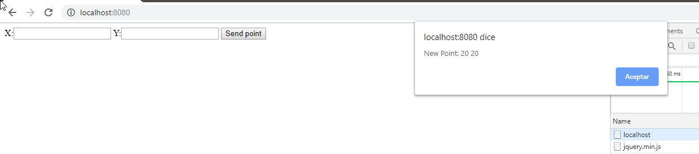
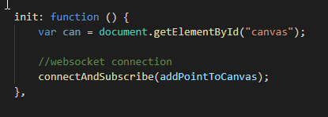
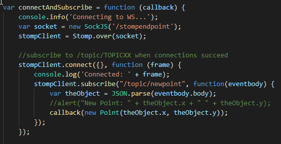
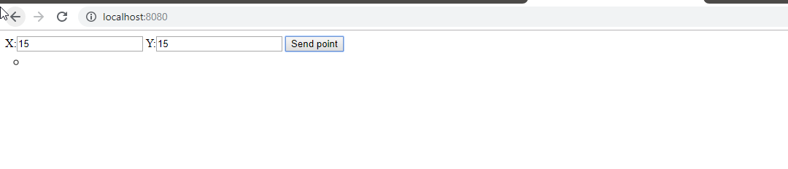
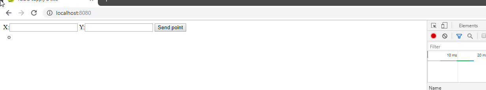
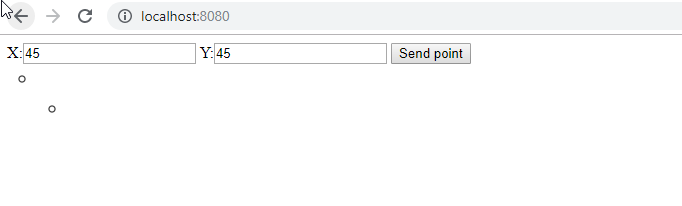
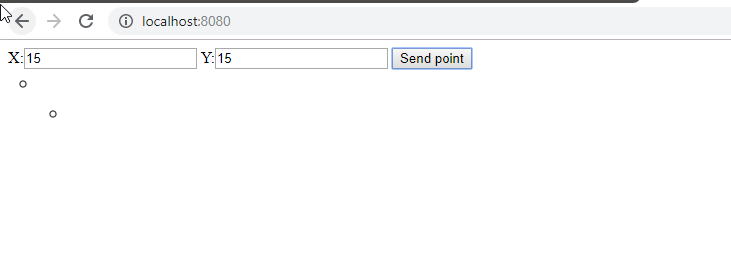

# Lab07-ARSW

# Compile and run instructions

Para ejecutar el proyecto se debe realizar el sigueinte comando

* mvn srping-boot:run

# Primera parte 

Se agrego en la funcion publishPoint ennviar un objeto 

Se modifico connectAndSubscribe para que todos los que esten suscritos puedan ver los cambios realizados 

Para tener el sigueinte resultado, donde se crear en una pesatña un punto 

y en el otro se ve el mensaje de creado

# Segunda parte 

Con el fin de que realice el circulo apenas se realice la peticion se debe colocar de la sigueinte manera:

y ademas debemos cambiar la alerta por un callback 

dandonos como resultado:

primer punto en la primera pestaña  

replica en la otra pestaña

segundo punto en la pestaña 2

replica en la pestaña 1

